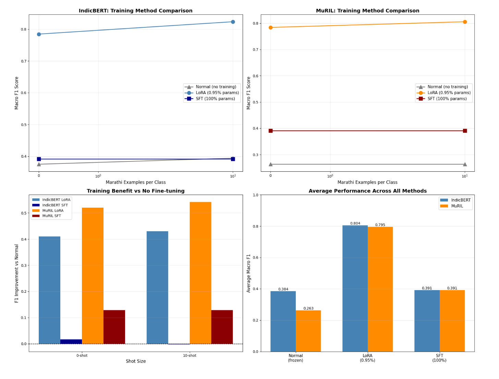

# Cross-Lingual Transfer for Indic Hate Speech Detection
[](https://www.python.org/downloads/)
[](https://pytorch.org/)
[](https://huggingface.co/transformers/)
[](LICENSE)

A comparative study of **IndicBERT-v2** and **MuRIL** for Hindi hate speech detection and zero-shot/few-shot cross-lingual transfer to Marathi, using **Low-Rank Adaptation (LoRA)** for parameter-efficient fine-tuning.

> 📄 **Course Project**: COMS 4776 - Neural Networks and Deep Learning, Columbia University  
---

## 🎯 Overview

This project investigates how different pretraining strategies in Indic-focused transformers affect downstream performance and cross-lingual transfer efficiency:

- **IndicBERT v2**: Trained on massive monolingual corpora (IndicCorp v2, 20.9B tokens) for broad coverage
- **MuRIL**: Uses Translation Language Modeling (TLM) and transliteration-aware pretraining for cross-lingual alignment

We demonstrate that **LoRA achieves state-of-the-art performance (F1 ≈ 0.80) while updating less than 1% of parameters**, and crucially, acts as a stabilizing regularizer where full fine-tuning fails.

## 📊 Key Results

| Method | Parameters | IndicBERT v2 (F1) | MuRIL (F1) |
|--------|------------|-------------------|------------|
| Frozen (Baseline) | ~1K | 0.375 | 0.263 |
| **LoRA** | **~2.6M (0.95%)** | **0.785** | **0.784** |
| Full Fine-tuning (SFT) | ~110M (100%) | 0.391 | 0.391 |



**Top row:** Macro-F1 vs Marathi examples for IndicBERT (left) and MuRIL (right). LoRA (blue/orange) stays high around 0.8, while SFT (dark lines) flatlines at ~0.4 — classic optimization collapse.

**Bottom-left:** F1 improvement over the frozen baseline. LoRA gives +0.4–0.5 gains, SFT barely moves the needle.

**Bottom-right:** Average performance across all settings. LoRA hits ~0.80 F1 with less than 1% of parameters. SFT with 100% parameters? Same as random.

### Key Findings

1. **LoRA dramatically outperforms full fine-tuning** — SFT collapses to majority-class predictions (F1 ≈ 0.39)
2. **IndicBERT v2 excels at zero-shot transfer** (F1: 0.794) due to corpus scale
3. **MuRIL shows superior few-shot adaptability** — outperforms IndicBERT by 2.1% F1 with just 50 target-language examples
4. **Parameter efficiency is not just computational** — LoRA acts as a necessary structural regularizer

## 🏗️ Architecture

```
┌─────────────────────────────────────────────────────────────┐
│                    Training Pipeline                         │
├─────────────────────────────────────────────────────────────┤
│                                                              │
│   Hindi HASOC Data ──► Preprocessing ──► Tokenization       │
│         │                                     │              │
│         ▼                                     ▼              │
│   ┌──────────────┐                    ┌──────────────┐      │
│   │ IndicBERT v2 │                    │    MuRIL     │      │
│   │  (ALBERT)    │                    │   (BERT)     │      │
│   └──────┬───────┘                    └──────┬───────┘      │
│          │                                    │              │
│          └──────────┬─────────────────────────┘              │
│                     ▼                                        │
│              ┌─────────────┐                                 │
│              │    LoRA     │  r=16, α=32                    │
│              │  Adapters   │  ~2.6M params                  │
│              └──────┬──────┘                                │
│                     ▼                                        │
│              Zero-shot / Few-shot                           │
│              Transfer to Marathi                            │
│                                                              │
└─────────────────────────────────────────────────────────────┘
```

## 🔧 LoRA Configuration

We apply LoRA to the **query (Wq)** and **value (Wv)** projection matrices:

```python
LoraConfig(
    r=16,                    # Rank of decomposition matrices
    lora_alpha=32,           # Scaling factor
    target_modules=["query", "value"],
    lora_dropout=0.1,
    bias="none",
    task_type=TaskType.SEQ_CLS
)
```

The forward pass becomes:
```
h = W₀x + ΔWx = W₀x + BAx
```
where `B ∈ ℝ^(d×r)` and `A ∈ ℝ^(r×k)` with `r ≪ min(d, k)`.

## 🚀 Quick Start

### Installation

```bash
# Clone the repository
git clone https://github.com/yourusername/indic-crosslingual-hate-speech.git
cd indic-crosslingual-hate-speech

# Install dependencies
pip install -r requirements.txt
```

### Dependencies

```txt
torch>=2.0.0
transformers>=4.30.0
peft>=0.4.0
datasets>=2.14.0
pandas>=2.0.0
numpy>=1.24.0
scikit-learn>=1.3.0
matplotlib>=3.7.0
seaborn>=0.12.0
indic-nlp-library>=0.92
```

### Running Experiments

```python
from final_nndl import run_experiment, compare_training_methods

# Option 1: Run with your own data
run_experiment(
    hindi_train="path/to/hindi_train.csv",
    hindi_test="path/to/hindi_test.csv",
    marathi_train="path/to/marathi_train.csv",
    marathi_test="path/to/marathi_test.csv"
)

# Option 2: Compare training methods (Normal vs LoRA vs SFT)
compare_training_methods(hindi_data, marathi_data, shot_sizes=[0, 10])
```

### Data Format

Expected CSV format:
```csv
text,task_1
"यह अच्छा है",NOT
"इनको मारो",HOF
```

Labels: `NOT` (Non-Hate), `HOF` (Hate/Offensive)

## 📈 Experiments

### 1. In-Language Performance (Hindi)

Training on HASOC Hindi data (2019-2021) with de-duplication:
- **Training samples**: 13,326 (8,008 NOT, 5,318 HOF)
- **Evaluation**: Macro-F1 and Accuracy

### 2. Cross-Lingual Transfer (Hindi → Marathi)

- **Zero-shot (k=0)**: Direct transfer without any Marathi supervision
- **Few-shot (k ∈ {5, 10, 50})**: Fine-tuning with k balanced examples per class

### 3. Training Strategy Comparison

| Strategy | Description | Trainable Params |
|----------|-------------|------------------|
| Normal (Frozen) | Only classification head | ~1K |
| LoRA | Low-rank adapters on attention | ~2.6M (0.95%) |
| SFT | Full model fine-tuning | ~110M (100%) |

## 📉 Results Visualization

The notebook generates comprehensive visualizations:

1. **Learning curves**: F1 vs. number of training examples
2. **Training method comparison**: Normal vs LoRA vs SFT
3. **Confusion matrices**: Per-class performance analysis
4. **Efficiency analysis**: Performance gain per parameter

## 🔬 Technical Details

### Preprocessing

```python
# Text normalization for Hindi
- Remove URLs and user handles
- Preserve hashtags and emojis (sentiment-bearing)
- Remove code-mixed instances (>50% non-Devanagari)
- Normalize Unicode characters
```

### Training Configuration

| Hyperparameter | Value |
|----------------|-------|
| Learning Rate | 2e-4 |
| Batch Size | 16 |
| Epochs | 5 |
| Warmup | 10% of steps |
| Optimizer | AdamW |
| Weight Decay | 0.01 |

### Hardware

Experiments conducted on **NVIDIA Tesla T4 GPU** (16GB VRAM)

## 📚 Dataset

We use the **HASOC (Hate Speech and Offensive Content)** benchmark from FIRE workshops:
- [HASOC 2019](https://hasocfire.github.io/hasoc/2019/)
- [HASOC 2020](https://hasocfire.github.io/hasoc/2020/)
- [HASOC 2021](https://hasocfire.github.io/hasoc/2021/)

## 🔗 References

1. [IndicBERT v2](https://arxiv.org/abs/2212.05409) - Doddapaneni et al., 2022
2. [MuRIL](https://arxiv.org/abs/2103.10730) - Khanuja et al., 2021
3. [LoRA](https://arxiv.org/abs/2106.09685) - Hu et al., 2022
4. [HASOC @ FIRE](https://hasocfire.github.io/)
